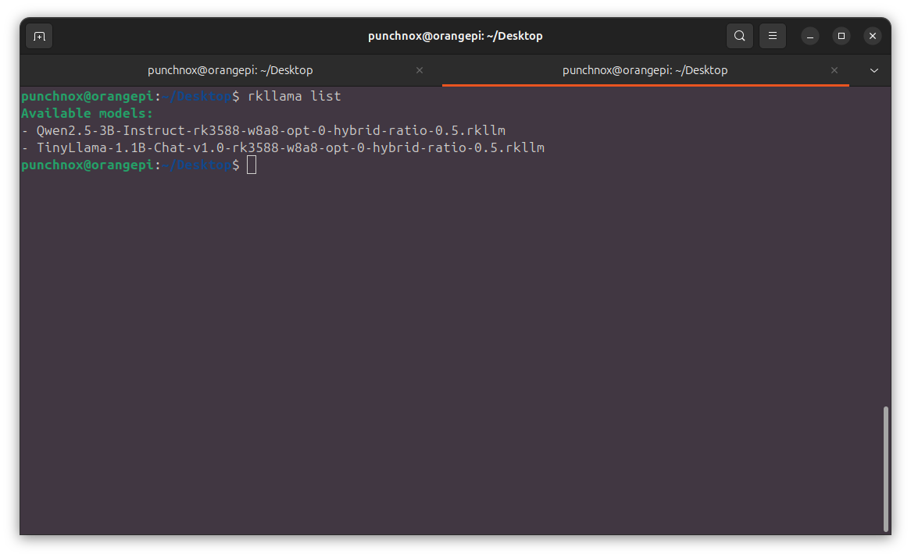

# RKLLama: LLM Server and Client for Rockchip 3588/3576

French version: [click](./documentation/french.md)

## Overview
A server to run and interact with LLM models optimized for Rockchip RK3588(S) and RK3576 platforms. The difference from other software of this type like [Ollama](https://ollama.com) or [Llama.cpp](https://github.com/ggerganov/llama.cpp) is that RKLLama allows models to run on the NPU.

* Version `Lib rkllm-runtime`: V1.1.4.
* Tested on an `Orange Pi 5 Pro (16GB RAM)`.

## File Structure
- **`./models`**: contains your rkllm models.
- **`./lib`**: C++ `rkllm` library used for inference and `fix_freqence_platform`.
- **`./app.py`**: API Rest server.
- **`./client.py`**: Client to interact with the server.

## Supported Python Versions:
- Python 3.8
- Python 3.9

## Tested Hardware and Environment
- **Hardware**: Orange Pi 5 Pro: (Rockchip RK3588S, NPU 6 TOPS).
- **OS**: Ubuntu 24.04 arm64.

## Main Features
- **Running models on NPU.**
- **Pull models directly from Huggingface**
- **include a API REST with documentation**
- **Listing available models.**
- **Dynamic loading and unloading of models.**
- **Inference requests.**
- **Streaming and non-streaming modes.**
- **Message history.**

## Documentation

- Client   : [Installation guide](#installation).
- API REST : [English documentation](./documentation/api/english.md)
- API REST : [French documentation](./documentation/api/french.md)

## Installation
1. Download RKLLama:
```bash
git clone https://github.com/notpunchnox/rkllama
cd rkllama
```

2. Install RKLLama
```bash
chmod +x setup.sh
sudo ./setup.sh
```
**Output:**


## Usage

### Run Server
*Virtualization with `conda` is started automatically, as well as the NPU frequency setting.*
1. Start the server
```bash
rkllama serve
```
**Output:**


### Run Client
1. Command to start the client
```bash
rkllama
```
or 
```bash
rkllama help
```
**Output:**


2. See the available models
```bash
rkllama list
```
**Output:**



3. Run a model
```bash
rkllama run <model_name>
```
**Output:**


Then start chatting *( **verbose mode**: display formatted history and statistics )*


## Adding a Model (`file.rkllm`)

### **Using the `rkllama pull` Command**
You can download and install a model from the Hugging Face platform with the following command:

```bash
rkllama pull username/repo_id/model_file.rkllm
```

Alternatively, you can run the command interactively:

```bash
rkllama pull
Repo ID ( example: punchnox/Tinnyllama-1.1B-rk3588-rkllm-1.1.4): <your response>
File ( example: TinyLlama-1.1B-Chat-v1.0-rk3588-w8a8-opt-0-hybrid-ratio-0.5.rkllm): <your response>
```

This will automatically download the specified model file and prepare it for use with RKLLAMA.

*Example with Qwen2.5 3b from [c01zaut](https://huggingface.co/c01zaut): https://huggingface.co/c01zaut/Qwen2.5-3B-Instruct-RK3588-1.1.4*

---

### **Manual Installation**
1. **Download the Model**  
   - Download `.rkllm` models directly from [Hugging Face](https://huggingface.co).  
   - Alternatively, convert your GGUF models into `.rkllm` format (conversion tool coming soon on [my GitHub](https://github.com/notpunchnox)).

2. **Place the Model**  
   - Navigate to the `~/RKLLAMA/models` directory on your system.  
   - Place the `.rkllm` files in this directory.  

   Example directory structure:
   ```
   ~/RKLLAMA/models/
       └── TinyLlama-1.1B-Chat-v1.0.rkllm
   ```

## Uninstall

1. Go to the `~/RKLLAMA/` folder
    ```bash
    cd ~/RKLLAMA/
    cp ./uninstall.sh ../
    cd ../ && chmod +x ./uninstall.sh && ./uninstall.sh
    ```

2. If you don't have the `uninstall.sh` file:
    ```bash
    wget https://raw.githubusercontent.com/NotPunchnox/rkllama/refs/heads/main/uninstall.sh
    chmod +x ./uninstall.sh
    ./uninstall.sh
    ```

**Output:**


---

## Upcoming Features
- Ability to pull models
- Add multimodal models
- Add embedding models
- `GGUF to RKLLM` conversion software

---

System Monitor:


---

## Author:
[notpunchnox](https://github.com/notpunchnox/rkllama)
