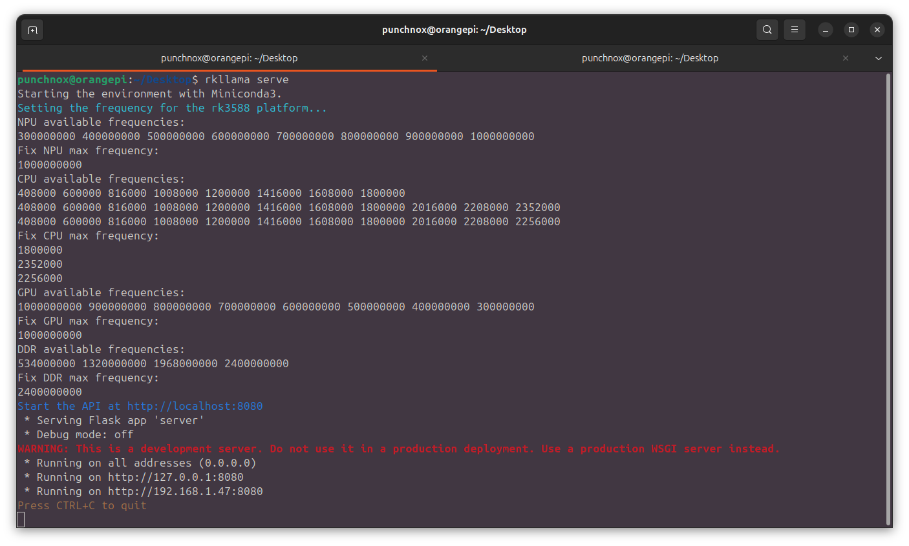
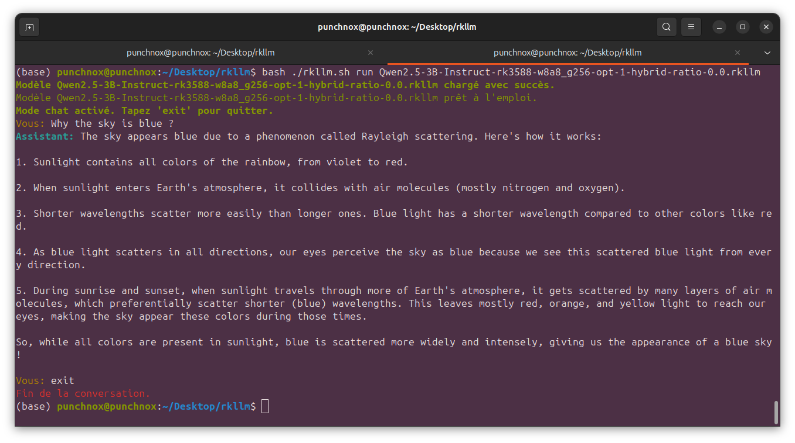

# RKLLama: Serveur et Client LLM pour Rockchip 3588/3576

## Présentation
Un serveur permettant d'exécuter et d'interagir avec des modèles LLM optimisé pour les platformes Rockchip RK3588(S) et RK3576.
La différence avec les autres logiciels de ce type comme: [Ollama](https://ollama.com) ou [Llama.cpp](https://github.com/ggerganov/llama.cpp), c'est que RKLLama permet de lancer les modèles sur NPU.

* Version `Lib rkllm-runtime`: V1.1.4.
* Testé sur un Orange pi 5 Pro ( 16Go RAM ).

## Structure des fichiers
- **`./models`** : Placez vos modèles.rkllm ici.
- **`./lib`** : Bibliothèque C++ `rkllm` utilisée pour l'inférence et `fix_freqence_platform`.
- **`./app.py`** : Serveur API Rest.
- **`./client.py`** : Client pour interagir avec le serveur.

## Version de Python supportés:
- Python 3.8
- Python 3.9

## Matériel et environnement testés
- **Matériel** : Orange pi 5 pro: ( Rockchip RK3588S, NPU 6 TOPS ).
- **OS** : Ubuntu 24.04 arm64.

## Fonctionnalités principales
- **Exécution des modèles sur NPU.**
- **Liste des modèles disponibles.**
- **Chargement et déchargement dynamique des modèles.**
- **Requêtes d'inférence.**
- **Mode streaming et non-streaming.**
- **Historique de messages.**

## Documentation

- Client : [ci-dessous](#installation).
- API    : [Click](./api/french.md)

## Installation
1. Télécharger rkllama :
```bash
git clone https://github.com/notpunchnox/rkllama
cd rkllama
```

2. Installer rkllama
```bash
chmod +x setup.sh
sudo ./setup.sh
```
**Output:**


## Add model ( file.rkllm )

1. Télécharger des models .rkllm sur [HuggingFace](https://huggingface.co), ou convertissez vos modèles gguf vers rkllm ( Logiciel bientôt disponible sur [mon github](https://github.com/notpunchnox))

2. Allez dans le dossier `~/RKLLAMA` et déposez vos fichiers dedans
    ```bash
    cd ~/RKLLAMA/
    ```

## Usage

### Run Server
*La virtualisation avec `conda` se lance automatiquement et de même pour la fixation de fréquence du NPU*
1. Lancer le serveur
```bash
rkllama serve
```
**Output:**



### Run Client
1. Commande pour lancer le client
```bash
rkllama
```
ou 
```bash
rkllama help
```
**Output:**


2. Voir les modèles disponibles
```bash
rkllama list
```
**Output:**


3. Lancer un modèle
```bash
rkllama run <model_name>
```
**Output:**


Puis commencer à discuter


## Uninstall

1. Aller chercher le dossier dans `~/RKLLAMA/`
    ```bash
    cd ~/RKLLAMA/
    cp ./uninstall.sh ../
    cd ../ && chmod +x ./uninstall.sh && ./uninstall.sh
    ```

2. Si vous n'avez pas le fichier `uninstall.sh`:
    ```bash
    wget https://raw.githubusercontent.com/NotPunchnox/rkllama/refs/heads/main/uninstall.sh
    chmod +x ./uninstall.sh
    ./uninstall.sh
    ```

**Output:**


---

## Prochains ajouts
- Possibilité de pull des modèles
- Ajout modèles multimodal
- Ajout modèles Embedding
- Logiciel de conversion `gguf to rkllm`
- Documentation API [folder](./api/README.md)

---
System Monitor:


---

## Author:
[notpunchnox](https://github.com/notpunchnox/rkllama)
